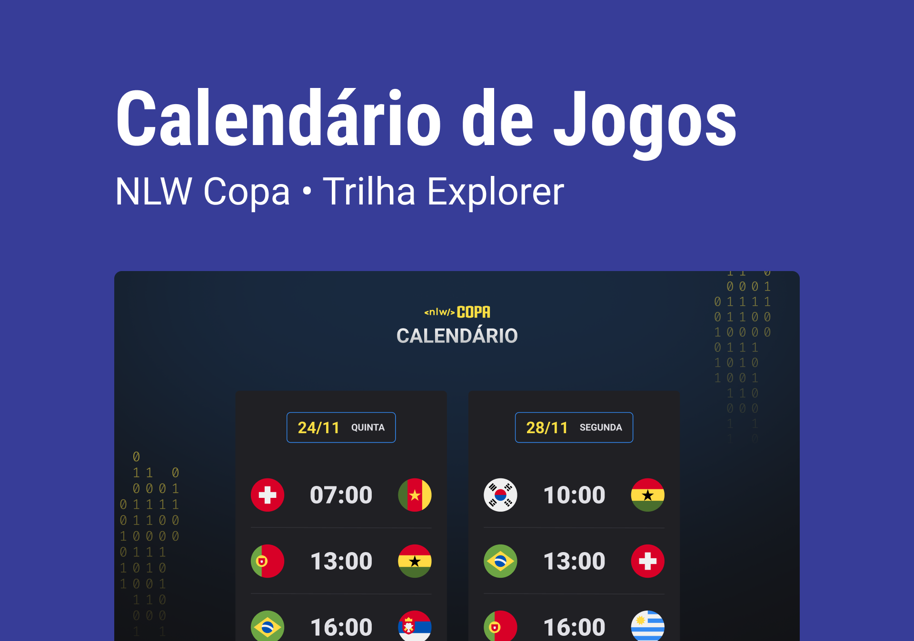

<h1 align="center">nlw-copa</h1>

Evento exclusivo e gratuito, promovido pela Rocketseat para ensino de tecnologia WEB

  

## 🚀 Techs
> * HTML & CSS
> * JavaScript
> * Git & Github

## 💻 Projeto
O Calendário da Copa é um projeto que mostra ps jogos da Copa de 2022.